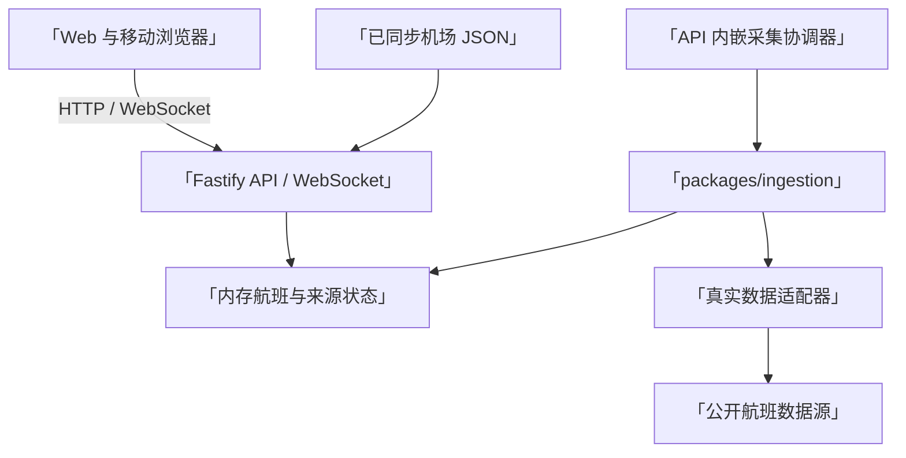
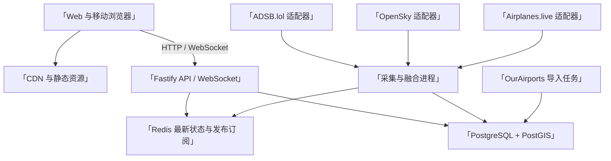
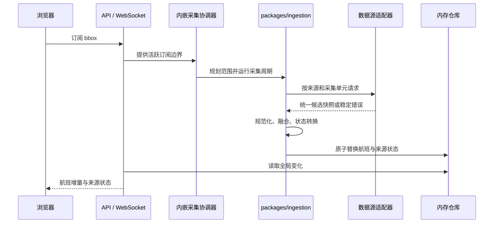
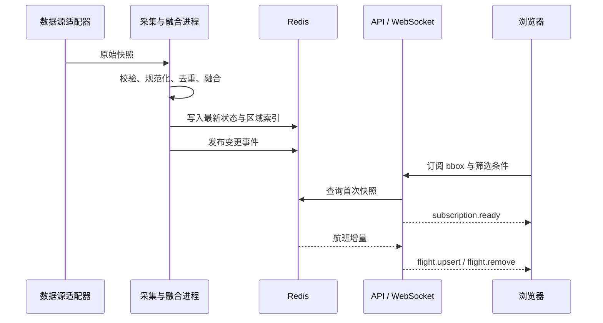

# 生产架构设计

## 1. 文档定位

本文区分当前可运行实现与后续扩展。当前仓库已实现 pnpm workspace、Fastify API、WebSocket、独立 ingestor、PostgreSQL/PostGIS 静态仓库、Redis 实时仓库与租约、真实位置适配器、静态同步以及 Next.js + MapLibre 界面。多 API 实例负载验证、可观测平台和生产授权配置仍属于后续工作。

## 2. 架构目标

- 支持约 1,000 个并发访客和 10 秒级位置更新。
- 对客户端隐藏第三方数据源差异。
- 单个数据源失败时保持核心浏览能力。
- 控制全球航班数据的网络体积，避免完整快照广播。
- 以模块化单体起步，保留独立扩展数据采集和实时分发的能力。
- 所有公开信息可追踪来源、新鲜度和融合结果。

### 2.1 已选方案

采用此前确认的方案 1：模块化单体与独立采集进程。

Web、公开 API、数据采集和共享领域包保存在同一个 pnpm workspace 中。`demo` 使用 API 内存仓库；`live` 由独立 ingestor 写入 Redis 最新状态和增量事件，API 从 PostgreSQL/PostGIS 查询机场，并从 Redis 初始化和更新实时缓存。Redis 租约保证同一环境只有一个 ingestor 主实例提交周期。

约 1,000 个并发连接是容量目标，不是当前验证结论。生产发布前仍需完成 WebSocket 负载测试、供应商配额核对和多实例故障验证。

## 3. 技术选型

### 3.1 Web 前端

- React、Next.js 和 TypeScript。
- MapLibre GL JS 负责地图渲染、图层、视野事件和航班标记。
- 当前使用 React Hooks 和组件本地状态管理 HTTP 请求结果、地图视野、选中对象和临时筛选条件。
- WebSocket 接收实时增量；HTTP 用于搜索、详情和首次快照。

选择 Next.js 的原因是可同时覆盖公开页面、服务端渲染、静态内容和前端路由。实时地图本身在客户端渲染，不依赖服务端逐帧生成。

HTTP、WebSocket、PostgreSQL 和 Redis 中的时间继续使用带时区的 ISO 8601 UTC。Web 展示层通过统一 `BrowserTime` 组件在浏览器挂载后按系统 IANA 时区格式化，并显示 `GMT±N`；服务端渲染和首次 hydration 使用相同占位，避免服务器时区与浏览器时区不同造成文本不一致。该格式化不参与排序、新鲜度、缓存有效期或回看计算。

后续状态关系和缓存策略复杂化后，可评估引入 TanStack Query 管理 HTTP 查询缓存，并使用 Zustand 或同等轻量状态库承载跨组件客户端状态。当前容量目标不要求预先增加这两项依赖。

### 3.2 服务端

当前实现：

- Node.js、TypeScript 和 Fastify。
- API 在 `live` 模式不创建供应商适配器或采集协调器。
- `packages/ingestion` 负责空间计划、每来源缓存与退避、采集周期、融合和状态转换。
- `demo` 内存仓库原子替换航班与来源状态。
- 独立 ingestor 通过 Redis 租约、GEO 索引、TTL 与 Pub/Sub 提交真实周期。
- OurAirports 和 GeoNames 同步命令生成经过契约校验的本地机场与城市别名 JSON 文件。
- GeoNames 大文件同步使用可配置超时，默认 4 小时；失败只输出稳定原因码并保留上一版文件。
- PostgreSQL 使用 trigram 与 PostGIS GiST 索引提供全球搜索和视野查询。
- ADSBdb 补全器使用有界队列、正缓存和负缓存，只填补实时航班缺失字段。
- 天气雷达通过 RainViewer 适配器读取最新帧元数据，Fastify 返回统一状态并代理 PNG 瓦片；前端只访问本项目 API。

当前生产基线：

- PostgreSQL 保存机场静态信息、数据源配置和必要的产品元数据。
- PostGIS 提供机场附近查询和空间计算。
- Redis 保存最新航班状态、区域索引、查询缓存、分布式锁和实时发布订阅。
- 独立采集进程负责访问供应商、规范化、去重和融合。
- OpenTelemetry、结构化日志和指标系统负责运行观测。

Fastify 继续作为公开 API 和实时连接入口。首期不引入复杂微服务治理，采集进程可以独立部署和扩容，但与 API 共用领域包和数据契约。

### 3.3 工程组织

使用 pnpm workspace 管理 TypeScript 单仓库。pnpm 是本项目唯一的 JavaScript/TypeScript 包管理器，根目录提交 `pnpm-lock.yaml`，不混用 npm、Yarn 或 Bun 锁文件。

当前与建议目录：

```text
apps/
  web/          # Next.js 前端
  api/          # Fastify HTTP 与 WebSocket 服务
  ingestor/     # 数据采集、规范化与融合
packages/
  domain/       # 航班、机场、航线领域模型
  contracts/    # HTTP 与实时事件契约
  adapters/     # ADSB.lol、OpenSky、Airplanes.live 适配器
  ingestion/    # 空间计划、调度、采集周期和来源状态
  config/       # 环境配置与校验
  observability/# 日志、指标与链路追踪（建议实施）
  testkit/      # 测试数据与供应商契约样例
docs/
scripts/
```

根目录已经包含 `package.json`、`pnpm-workspace.yaml` 和 `pnpm-lock.yaml`。工作区命令由根目录统一提供，各应用和包不维护相互冲突的包管理入口。

## 4. 总体结构

### 4.1 当前单实例实现



### 4.2 建议生产结构



## 5. 模块边界

### 5.1 数据源适配器

每个供应商实现统一接口，负责：

- 认证、限流和请求重试。
- 供应商响应校验。
- 将原始字段转换为来源中立的候选记录。
- 保存来源标识、采集时间和可用于融合的质量信息。
- 将供应商错误转换为统一错误类型。

适配器不得承担跨供应商去重，也不得把供应商响应直接返回浏览器。

概念接口：

```ts
interface FlightPositionProvider {
  readonly providerId: string;
  fetchSnapshot(scope: GeoScope): Promise<ProviderSnapshot>;
  health(): Promise<ProviderHealth>;
}
```

当前已实现 ADSB.lol、Airplanes.live 和 OpenSky 适配器。OpenSky 支持匿名请求和可选 OAuth 2.0 Client Credentials；所有凭证仅由服务端读取。

#### 5.1.1 天气雷达适配器（当前实现）

天气雷达使用独立于航班位置融合的数据适配层。当前实现选择 RainViewer 免费公共接口，只读取最新雷达帧，并通过 Fastify 返回统一状态和同源瓦片地址。浏览器不依赖 RainViewer 的主机名、帧路径或响应结构。

服务端天气雷达能力默认启用，可通过 `WEATHER_RADAR_ENABLED=false` 显式关闭。该配置与前端地图图层开关相互独立；前端图层仍默认关闭，由访客决定是否展示雷达。

雷达元数据和用户实际访问过的 PNG 瓦片使用 API 进程内有界缓存。缓存 TTL 为 24 小时，同时受条目数和总字节数上限约束；达到任一容量上限时按 LRU 提前淘汰。缓存不构成历史档案，不写入 PostgreSQL 或 Redis，也不提供时间轴或历史查询。

雷达帧不超过 15 分钟时标记为最新；15 分钟至 2 小时标记为延迟；2 至 24 小时标记为历史缓存，并明确说明不是当前天气；超过 24 小时停止展示。天气状态与航班数据源状态相互独立。

瓦片代理只接受服务端已注册的帧 ID、0–7 合法缩放级别和对应范围内的瓦片坐标。实现固定允许的 HTTPS 上游主机，校验 PNG 响应类型，在读取过程中限制响应体大小，并设置请求超时，因此该接口不能被用作通用 HTTP 代理。成功瓦片允许 CDN 最多复用 300 秒，但实际 `max-age` 还受帧缓存剩余 TTL 和雷达帧 24 小时寿命共同约束；响应要求重新验证且不允许 `stale-if-error` 继续使用过期帧。

### 5.2 共享采集模块

`packages/ingestion` 是当前实现，包含：

- 固定网格采集计划、日期变更线拆分、范围去重和单轮单元上限。
- 每个数据源独立的缓存、最小请求间隔、超时后退避和 `Retry-After` 处理。
- 多来源并行采集、规范化、融合和来源状态转换。
- 全部来源失败时保留上次成功航班，并按当前时间重新计算新鲜度。

相同采集单元在缓存有效期内不重复访问上游。没有活跃订阅和默认区域时，API 保留现有状态但不发起航班请求。

### 5.3 规范化模块

规范化模块将候选记录转换为统一单位和字段：

- 时间统一为 UTC。
- 面向浏览器的领域契约保留原始 UTC；本地时区只在 Web 展示层计算。
- 经纬度使用 WGS 84。
- 高度使用米，地速使用千米每小时，航向使用角度。
- 空字符串、哨兵值和供应商特有状态转换为明确的缺失值。
- 对所有外部输入执行运行时校验。

### 5.4 去重与融合模块

融合优先使用 ICAO 24 位地址识别航空器；该字段缺失时，可结合同一时间窗口内的航班号、位置和运动特征生成低置信度匹配。

字段选择遵循以下原则：

1. 新鲜度满足要求。
2. 来源健康且字段通过校验。
3. 在相近时间内，选择精度或完整度更高的记录。
4. 冲突无法可靠消解时保留缺失值，并降低覆盖度。

融合结果必须包含：

- 稳定的内部航班或航空器 ID。
- 字段值与最后更新时间。
- 参与融合的数据源。
- 整体覆盖度或置信等级。
- 是否为推断字段。

### 5.5 机场模块

机场模块导入 OurAirports 与 GeoNames 静态数据，提供名称、代码、中英文城市、国家、坐标、海拔和机场类型查询。默认列表按 bbox 查询固定地理网格；全局搜索使用代码和文本索引。

同步命令下载并校验 OurAirports 与 GeoNames 文件；`data:db:sync` 在事务中导入 PostgreSQL，失败时回滚并保留上一版本。机场视野和全局搜索使用 PostGIS、trigram 与别名索引；周边实时航班来自 Redis 初始化的 API 实时缓存。该模块不生成到港、离港或延误状态。

### 5.6 航线匹配模块

航线匹配优先使用数据源提供的可靠起终点信息。信息缺失时不根据当前位置单独猜测起终点。

匹配结果应包含规则版本和覆盖度，供界面说明结果是实时归并，不是官方完整班次。

### 5.7 查询 API

查询 API 提供搜索、首次快照和对象详情。建议首期契约：

```text
GET /api/v1/search?q=
GET /api/v1/flights/:flightId
GET /api/v1/airports/:airportCode
GET /api/v1/airports/:airportCode/nearby-flights
GET /api/v1/routes?origin=&destination=
GET /api/v1/map/snapshot?bbox=&zoom=&filters=
GET /api/v1/data-sources/status
```

接口采用游标或明确上限，禁止返回无限列表。错误响应使用稳定错误码，不暴露供应商凭据、内部堆栈或数据库信息。

### 5.8 实时分发

WebSocket 连接建立后，客户端提交地图边界、缩放级别和筛选条件。服务端返回该订阅范围内的首次快照，随后只发送新增、修改和移除事件。

建议事件：

```text
subscription.ready
flight.upsert
flight.remove
source.status
heartbeat
```

客户端移动地图时以防抖方式更新订阅。服务端限制订阅范围和更新频率，防止单个连接请求全球最高精度数据。

当前 broadcaster 保存一份全局航班表、一份全局来源状态表和每个连接的一份边界框，不为每个连接复制完整航班表。设航班数为 `F`、来源状态数为 `S`、连接数为 `C`，状态内存复杂度为 `O(F + S + C)`。每次 tick 先计算全局变化，再按连接边界发送对应增量；发送时间还取决于变化数和连接数，不将其表述为 `O(F + S + C)`。

## 6. 数据流程

### 6.1 当前数据流程



### 6.2 建议生产数据流程



## 7. 容量与性能

### 7.1 首期容量假设

- 并发连接：约 1,000。
- 位置更新：正常目标为 10 秒。
- 访问以地图读取为主，写入只来自采集进程和后台任务。
- 单个访客只订阅当前地图视野，不默认接收完整全球数据。

这些数值是首期目标。当前自动化测试验证增量契约、订阅范围和状态内存结构，不替代 1,000 个真实并发连接的负载测试。

### 7.2 关键措施

- 地图数据按空间网格或 geohash 建立区域索引。
- 首次快照使用压缩 HTTP 或 WebSocket 消息。
- 实时消息只包含变化字段，并对高频位置更新合并。
- 相同订阅区域共享服务端计算结果，避免为每个连接重复过滤全球集合。
- Redis 保存最新状态，PostgreSQL 不承担当次位置广播的高频读写。
- 航班标记在前端使用 MapLibre 图层或批量渲染，不创建大量独立 DOM 节点。

### 7.3 扩展顺序

容量超过单实例稳定范围时，按以下顺序扩展：

1. 增加 API 实例，使用 Redis 发布订阅共享实时事件。
2. 按数据源或地理分区扩展采集进程。
3. 将区域过滤与实时分发拆为独立服务。
4. 只有在长期轨迹成为明确需求后，再引入专门的时序或列式存储。

## 8. 可靠性与降级

当前实现：

- 每个数据源使用独立超时、缓存、最小请求间隔和有上限的指数退避。
- 数据源健康度不影响其他适配器继续采集。
- 融合记录保留最后成功时间，超过阈值后标记为过期，不伪装为实时数据。
- WebSocket 使用心跳、断线重连和指数退避策略。
- `live` 模式不切换到 `demo`。首次成功前返回空航班集合；后续全部来源失败时保留上次成功航班，并更新最近请求状态。
- 单个来源的缓存、限速和退避状态相互独立，不阻塞其他来源。
- 世界视野受单轮采集单元上限和免费来源限制，不能据此推断完整全球覆盖。

建议实施：

- Redis 暂时不可用时，API 继续提供机场静态信息和明确的实时服务不可用状态。
- PostgreSQL 迁移采用向前兼容策略，发布期间允许新旧应用实例短暂共存。
- 在调度层增加显式并发上限和熔断状态，并通过故障注入验证恢复行为。

## 9. 安全与合规

当前实现：

- 所有数据源密钥只保存在服务端密钥系统或环境变量中。
- 启动时校验配置，日志中对凭据和请求头脱敏。
- 搜索参数、边界框、筛选条件和供应商响应均在系统边界校验。
- 浏览器只访问本项目 API 和 WebSocket；供应商响应经服务端适配器转换为统一模型。
- 对外错误使用稳定错误码和安全摘要，不包含上游响应正文、凭证或内部堆栈。

建议实施：

- 为公开 API 增加按 IP、连接和接口成本区分的限流策略。
- 使用 Fastify Helmet 或等效机制配置内容安全策略和安全响应头。
- 根据生产域名收紧跨域规则，并验证预检请求和 WebSocket 来源。
- 数据源投入生产前复核使用条款、署名要求、速率限制和再分发限制。
- 不记录不必要的访客身份信息，并为生产日志设置最短必要保留周期。

## 10. 可观测性

核心指标包括：

- 各数据源请求成功率、延迟、限流和熔断状态。
- 每轮采集记录数、丢弃数、融合数和过期数。
- 最新数据年龄和不同区域的覆盖度。
- WebSocket 当前连接数、订阅数、消息速率和断开原因。
- HTTP 请求量、错误率和延迟分位数。
- Redis 与 PostgreSQL 的连接、内存、延迟和错误。

日志使用关联 ID 连接采集、融合、查询和推送事件，但不记录供应商密钥或完整授权信息。

## 11. 部署基线

前端通过 `NEXT_PUBLIC_MAP_STYLE_URL` 接入生产地图样式和瓦片服务。仓库内的 OpenStreetMap 公共栅格配置只作为本地演示回退，不计入 1,000 并发容量承诺。

首期建议单区域部署：

- CDN 承载 Next.js 静态资源和可缓存页面。
- 至少 2 个 API 实例，部署在负载均衡器后。
- 1 个主采集进程，保留快速替换实例；并通过分布式锁防止重复采集。
- 托管 PostgreSQL、PostGIS 和 Redis。
- 数据库每日备份，配置与迁移纳入版本控制。

生产发布必须支持健康检查、滚动更新、快速回滚和数据库迁移审计。

## 12. 实施前检查

开始接入真实数据前完成以下确认：

- 逐一验证数据源条款、配额、认证方式和可接受使用范围。
- 使用真实样本建立适配器契约测试和字段缺失样例。
- 测量典型地图视野的首次快照与增量消息大小。
- 通过负载测试验证 1,000 个并发 WebSocket 连接和 10 秒更新周期。
- 明确数据新鲜度、过期和覆盖度的计算阈值。
- 在发布流水线中运行当前 workspace 的 `pnpm verify`，并保存负载测试结果。
