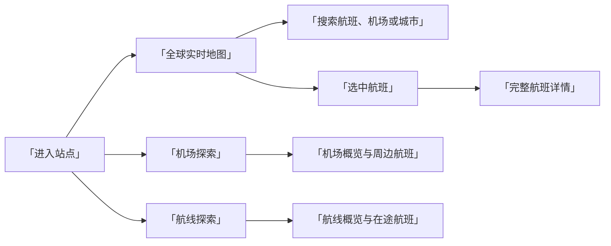

# 产品与界面设计

## 1. 产品定义

「航迹」是面向公众的全球实时航班地图。访客无需登录即可观察航班位置、查找航班或机场、查看单个航班状态，并按机场或航线继续探索。

首期产品关注「当前正在发生什么」，不替代航空公司的行程管理、机场官方航班动态或专业空管系统。

## 2. 目标用户

### 航空爱好者

关注全球或特定区域的实时飞行活动，希望连续观察航班位置、速度、高度和航向。

### 普通访客

通过航班号、机场或城市快速找到目标，了解航班目前所在位置和公开可得的基础信息。

### 出行关注者

需要查看某个航班的实时位置，但首期不提供值机、登机口、行李、延误承诺或官方通知。

## 3. 产品目标

- 在世界地图上展示公开来源可获得的实时航班，并保持可用的交互性能。
- 让访客在少量操作内完成航班、机场或航线查询。
- 将多家公开数据源整理成一致、可解释的产品信息。
- 在数据缺失、延迟或降级时给出明确状态，避免形成错误判断。
- 桌面端保持较高的信息密度，手机端保持主要任务可操作。

首期成功标准：

- 支持约 1,000 个并发连接。
- 正常情况下，客户端每 10 秒以内获得一次位置更新。
- 搜索、选中航班、机场探索和航线探索均有桌面端与手机端界面。
- 数据源异常不会导致整个页面不可用；界面能够显示数据新鲜度和降级状态。

## 4. 首期范围

### 包含

- 全球实时航班地图。
- 航班、机场和城市搜索。
- 单个航班选中态与完整详情。
- 地图图层、定位和缩放控制。
- 0–15 分钟短时位置估算回看。
- 数据来源、更新时间和服务状态。
- 机场探索、机场概览和机场周边实时航班。
- 航线起终点选择、航线概览和当前在途航班。
- 桌面端和手机端响应式界面。
- 加载、空结果、网络错误、数据过期和部分数据源不可用等系统状态。

### 暂不包含

- 账号、登录、收藏同步和跨设备历史记录。
- 付费订阅、广告和商业数据授权管理。
- 订票、改签、值机和行程管理。
- 机场到港板、离港板、登机口、行李转盘和延误预测。
- 面向空管、机场运行或航空公司的专业决策能力。
- 长期轨迹回放和大规模历史数据分析。

短时回看只根据当前航向、地速和位置估算最近 0–15 分钟的展示位置，用于界面观察，不代表系统已经保存真实历史轨迹。

## 5. 信息架构

顶部一级导航包含三个入口：

1. 「全球实时」：以地图为主，观察和搜索当前航班。
2. 「机场」：发现机场、选择机场并查看周边实时航班。
3. 「航线」：选择起终点机场并查看当前匹配的在途航班。

全局搜索覆盖航班号、机场代码、机场名称和城市，支持中文、英文和常用拉丁拼写。机场搜索不受当前地图视野限制。搜索结果根据对象类型进入航班详情、机场概览或相应地图状态。

## 6. 页面清单

### 6.1 全球实时地图

地图占据主要视区，叠加航班标记、搜索框、图层控制、定位控制和实时数据状态。桌面端在右侧展示选中对象；手机端使用底部抽屉。

### 6.2 搜索结果

搜索结果按航班、机场和城市区分，显示匹配对象的核心识别信息。无结果时提供修改关键字或返回地图的明确入口。

### 6.3 航班选中态

地图突出当前航班和已知航迹，详情区域展示：

- 航班号、航空公司和机型。
- 出发地与目的地。
- 高度、地速、航向和爬升率。
- 最后更新时间、来源和覆盖度。

不完整字段应隐藏或标记为「未获得数据」，不得使用虚构值填充。

### 6.4 完整航班详情

提供更完整的领域字段和数据说明。该页面延续地图选中态，不引入账号或交易操作。

### 6.5 机场探索

机场探索默认展示当前地图视野内的机场，并支持继续加载。输入搜索词后切换为全球机场搜索；清空搜索后恢复当前视野列表。地图显示 API 返回的视野机场和实时航班。

选择机场后显示：

- IATA、ICAO、机场名称、城市、国家和坐标。
- 机场类型、海拔和数据覆盖情况。
- 指定半径内的实时航班数量与航班列表。
- 数据更新时间和来源说明。

「周边实时航班」由航班位置与机场坐标计算，不等同于机场到港或离港班次。

### 6.6 航线探索

航线页面以起点机场和终点机场为输入。选择后展示：

- 起终点机场和大圆距离。
- 地图航线与匹配航班位置。
- 当前匹配的在途航班数量、飞行进度、高度和地速。
- 匹配规则、更新时间和覆盖度说明。

航线匹配是基于公开航班信息和实时位置的归并结果，不承诺完整班次覆盖。

### 6.7 筛选与图层

首期筛选用于减少地图噪声，包含高度范围、航空公司、航班状态或数据质量等可由统一模型可靠支持的条件。图层控制用于切换航班、机场、航迹和地图信息层。

### 6.8 数据状态

数据状态页或状态面板展示：

- 当前可用的数据源。
- 最后成功更新时间。
- 数据是否延迟或部分降级。
- 下一步可执行操作，例如重试、缩小地图范围或稍后刷新。

### 6.9 短时位置回看

桌面端底部回看条支持查看 0–15 分钟前的估算位置，并可一键返回实时位置。手机端首期不常驻显示回看条，避免占用地图和底部抽屉的核心空间。估算位置不进入长期存储，也不作为航迹历史事实展示。

## 7. 桌面端设计

- 地图是主画布，右侧详情面板宽度稳定，避免选中对象时地图大幅跳动。
- 搜索和探索面板位于地图左侧，控制在可扫读的单列宽度。
- 关键数值使用等宽字体，航班号和机场代码保持高辨识度。
- 主要操作使用蓝色，选中航班可使用橙色强调，服务正常使用绿色状态。
- 面板采用浅色底、细描边和小圆角，延续航空图表式视觉语言。

## 8. 手机端设计

- 地图铺满视区，搜索框位于顶部安全区域下方。
- 机场、航线和航班信息使用底部抽屉，抽屉保留拖动把手和清晰标题。
- 主要控制的最小可点击区域为 44 × 44 px。
- 抽屉展开后仍保留必要的地图上下文，不用缩小字体塞入桌面信息。
- 宽表格改成卡片或分组指标，不依赖水平滚动完成核心任务。

## 9. 数据表达规则

- 「实时」表示最新位置在产品规定的新鲜度窗口内，不表示零延迟。
- 时间统一保存为 UTC，界面根据位置展示 UTC 或本地时间并明确标识。
- 高度、速度和距离在内部使用统一单位，界面可根据地区设置转换。
- 来源冲突时展示融合后的结果和覆盖度，不在主界面暴露供应商原始字段。
- 超过新鲜度阈值的数据降低视觉强调，并显示最后更新时间。
- 无法确认出发地或目的地时不生成确定航线。

### 9.1 真实数据覆盖边界

- 免费公开来源不保证完整全球覆盖，数据量会受接收站分布、供应商策略、请求频率和当前采集范围影响。
- 真实采集优先覆盖活跃地图视野；没有活跃视野时才使用配置的默认区域。
- 世界视野受单轮采集单元上限约束，可能只显示已经采集并仍保留在缓存或内存中的局部航班。
- 界面中的航班数量是当前获得并通过校验的记录数，不代表全球在途航班总数。
- `live` 模式不使用演示航班补足覆盖。全部来源失败时保留上次成功航班，并根据数据年龄标记延迟或过期。

### 9.2 数据状态语义

数据状态反映数据源最近一次实际请求结果，而不是仅根据页面是否仍有航班判断服务正常。状态面板应区分：

- 最近请求时间与结果。
- 最后成功时间与最近成功记录数。
- 正常、部分降级或不可用状态。
- 限流、认证失败、超时、响应无效或上游错误等稳定错误类型。

缓存命中或限速等待期间可能没有新的上游请求，此时保留上一条来源状态，不把缓存数据误报为新的成功请求。

## 10. 系统状态

每个核心页面均应覆盖以下状态：

- 首次加载。
- 正常更新。
- 无搜索结果。
- 当前视野没有航班。
- 单个数据源不可用，系统使用其他来源继续服务。
- 所有实时来源不可用，仅保留地图和机场静态信息。
- 网络断开后重连。
- 数据超过新鲜度阈值。

## 11. 设计来源

当前界面保存在 Ardot 文件 `hangban` 中：

- 文件 ID：`702710471706421`
- 当前已确认设计页面：`main`（页面 ID `0:1`）
- 视觉深化工作页面：`main_deep`（页面 ID `16:1`）
- 视觉深化页面链接：<https://ardot.tencent.com/file/702710471706421?node_id=16%3A1>
- 设计变量集：`Aero Chart Tokens`

已完成全球地图、搜索、航班详情、机场详情、筛选、数据状态、系统状态、机场探索和航线探索的桌面端与手机端设计。

## 12. 当前实现的视觉核对记录

2026-07-11 已使用 1440 × 900 和 390 × 844 原生视口，对全球实时、筛选、数据状态、完整航班详情、机场和航线页面进行逐项核对。

| 核对项     | 当前实现                                                           | 与 Ardot 原型的关系                      |
| ---------- | ------------------------------------------------------------------ | ---------------------------------------- |
| 页面结构   | 顶部导航、左侧探索区、右侧详情和手机底部抽屉保持一致               | 按原型还原                               |
| 字体与层级 | 航班号、机场代码和指标使用高辨识度窄体或等宽字体                   | 按原型语义还原，使用系统可用字体         |
| 图标       | 通用操作使用 Lucide，地图航班使用带白色描边并按航向旋转的飞机标记  | 按原型视觉语言还原                       |
| 地图底图   | 使用 MapLibre GL JS 和低饱和度 OpenStreetMap 栅格底图              | 有意替代原型中的示意地图                 |
| 航线几何   | 使用真实大圆插值，并在日期变更线拆分线段                           | 比原型示意曲线更符合产品规格             |
| 数据数量   | 本地默认展示演示适配器返回的当前数据集                             | 不沿用原型中的 12,842 架等展示数字       |
| 航班字段   | 只展示统一模型已获得的实时字段、来源和覆盖度                       | 不复刻原型中无法验证的计划时刻或延误信息 |
| 手机布局   | 关键控件保持至少 44 × 44 px，探索和详情使用底部抽屉                | 按原型还原并适配真实内容长度             |
| 状态与交互 | 筛选、空结果、断线重连、来源降级、过期、定位拒绝和返回地图均可操作 | 补齐原型状态并通过 E2E 验证              |

后续 UI 调整必须先更新对应原型图并完成设计确认，再修改前端实现。仅修复实现与已确认原型不一致的问题时，可按现有原型直接还原，并更新本节记录。

### 2026-07-12 浅色航空图表视觉深化

本轮以 Ardot `main_deep（16:1）` 为确认基线，使用 1440 × 900 和 390 × 844 原生视口核对全球实时、搜索、航班摘要、机场、航线、筛选和数据覆盖状态。核对截图保存在：

- `.ardot-qa/visual-deepening/implementation-desktop-1440x900.webp`
- `.ardot-qa/visual-deepening/implementation-mobile-390x844.webp`

| 核对项       | 核对结果                                                               | 有意差异或说明                                        |
| ------------ | ---------------------------------------------------------------------- | ----------------------------------------------------- |
| 桌面端结构   | 64 px 顶栏、地图主舞台、右侧航班详情和底部回看条层级稳定               | 使用真实 MapLibre 地理范围，不复刻 Ardot 示意地球视角 |
| 手机端结构   | 390 × 844 下无水平滚动；搜索、地图工具和半展开抽屉互不遮挡             | 手机端隐藏缩放按钮和桌面回看条                        |
| 触控尺寸     | 手机端图层与定位按钮均为 44 × 44 px                                    | 桌面端保持更紧凑的 40 × 40 px 工具密度                |
| 地图对象层级 | 普通航班弱化，选中航班使用橙色、白色描边和 halo；已飞与未飞航迹分层    | 真实航班位置、数量和大圆几何以运行数据为准            |
| 信息可信度   | 航班来源、路线推断、机场周边语义、航线归并依据和当前覆盖范围均明确展示 | 不展示计划时刻、延误、登机口和不可验证历史趋势        |
| 筛选与状态   | 筛选即时生效；数据面板展示最后成功、记录数、错误类型和降级结果语义     | 当前航班数明确不代表全球实际在途总数                  |
| 响应式状态   | 机场与航线无水平溢出；数据覆盖使用可滚动全高抽屉；主要操作支持键盘关闭 | 开发模式截图中的 Next.js 调试浮标不属于生产构建       |

浏览器核对未发现框架错误覆盖或相关控制台错误。手机端机场与航线页面的 `scrollWidth` 均为 390 px，地图主要按钮为 44 × 44 px；数据覆盖抽屉在 768 px 可用高度内滚动，不扩大文档宽度。
